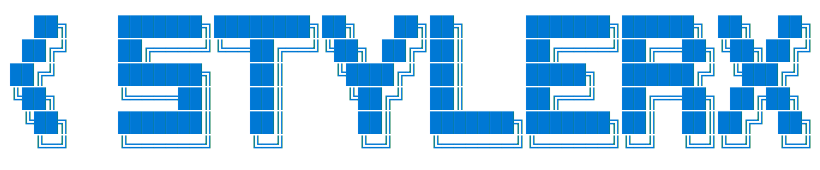

<!-- Banner Logo -->


<!-- Typing Demo -->


<!-- Navigation -->
<p align="center">
  <a href="docs/wiki/Home.md"></a>
  <a href="docs/wiki/Installation.md"></a>
  <a href="docs/wiki/Building-from-Source.md"></a>
  <a href="docs/wiki/Usage.md"></a>
  <a href="docs/wiki/Theme-Format.md"></a>
  <a href="docs/wiki/CLI-Reference.md"></a>
  <a href="docs/wiki/Troubleshooting.md"></a>
</p>

<h1 align="center">StylerX — make OBS look how you want</h1>
yo, this is a plugin for OBS Studio that lets you change the whole look of it in real time. no more being stuck with the same dark theme forever. every color, every panel, every button — you can tweak it all while obs is running and see the changes instantly.

---

## what is this

stylerx is a live theme editor that sits inside obs as a dockable panel. it works by layering a qt stylesheet on top of obs's normal appearance. that means nothing gets broken or overwritten — your theme just sits on top like a filter. turn it off and obs goes back to exactly how it looked before.

its written in c++17 with qt6 and hooks into obs through the official frontend api. no sketchy hacks, no memory patching, none of that.

---

## what can you do with it

### pick colors live

there are 20+ different ui elements you can change the color of:

- background — the main dark area behind everything
- panels — side panels and container backgrounds
- dock background — the inside of dockable windows
- buttons — regular buttons and toolbar buttons
- button hover — what buttons look like when you mouse over them
- button pressed — what buttons look like when you click them
- borders — all the subtle line separators everywhere
- accent — the blue highlight color (or whatever color you want)
- selected — when you click an item in a list or tree
- text — the main text color
- disabled text — text on stuff you cant interact with
- menu background — dropdown menus and the menu bar
- menu text — text inside menus
- tooltips — those little info boxes that pop up
- scrollbars — the scrollbar track and handle
- sliders — slider controls
- checkboxes — checkboxes and radio buttons
- input fields — text boxes, spin boxes, combo boxes
- tabs — the tab bar at the top of tabbed panels
- status bar — the bar at the bottom of obs

for each one you can pick the color with:

- a hex input — just type `#ff6600` or whatever
- rgb sliders — red, green, blue from 0 to 255
- hsv sliders — hue, saturation, value
- an alpha slider — transparency
- a color picker dialog — click pick and get a full dialog

they all stay in sync so no matter which one you use to change a color, the others update to match.

### edit the raw stylesheet

if you know css, you already know qss (qt style sheets). its basically the same thing. stylerx has a full code editor built in with:

- syntax highlighting — selectors are purple, properties are blue, values are green, comments are grey, hex colors are yellow
- line numbers — so you can keep track of where you are
- search and replace — ctrl+f to find, ctrl+h to find and replace
- replace all — one button to swap every occurrence
- ctrl+s to apply — hit save and the stylesheet gets applied to obs immediately
- cursor position — shows you what line and column youre on

you can use this to do stuff the color picker cant, like setting border radii, padding, font sizes, gradients, or targeting specific widget classes that the presets dont cover.

### inspect widgets

ever wondered what a specific element in obs is called or what stylesheet its using? the inspector lets you:

1. toggle inspector mode with a checkbox
2. hover over any widget in obs — it gets highlighted with an orange overlay
3. click on it — you see its class name, object name, stylesheet, and all the hex/rgb colors found in that stylesheet
4. hit "edit these colors" to jump straight to the colors tab

this is super useful when you want to style something specific but dont know what its called internally.

### save, export, import, duplicate

your themes are stored as json files in `%APPDATA%/StylerX/themes/`. each theme file looks like this:

```json
{
  "format_version": 1,
  "id": "a1b2c3d4-e5f6-...",
  "name": "my theme",
  "author": "you",
  "is_read_only": false,
  "is_favorite": true,
  "created": "2026-07-06T17:00:00Z",
  "modified": "2026-07-06T17:30:00Z",
  "colors": {
    "background": "#1e1e1e",
    "panels": "#252526",
    "accent": "#0078d4",
    "text": "#cccccc"
  }
}
```

from the dock you can:

- **add** — create a new blank theme
- **save** — save the current theme to disk (if its read-only it creates an editable copy)
- **duplicate** — make a copy of any theme
- **delete** — remove a theme (cant delete read-only ones, gotta duplicate first)
- **export** — save a theme as a .json file anywhere on your computer
- **import** — load a .json theme file from anywhere
- **favorite** — mark themes with a heart so they stand out in the list
- **rename** — change the name from the right-click menu
- **reset** — clear the active theme and go back to obs default

there's also a search bar at the top that filters your theme list as you type.

### debounced updates

when youre dragging a slider or typing in a hex box, stylerx doesnt spam-apply the stylesheet on every single change. it waits until you stop for a short moment, then applies. this means no flickering and no lag, even if you mash the controls.

you can configure the debounce interval or turn it off entirely if you want instant feedback.

### settings persistence

stylerx remembers where you put the dock and whether it was visible. close obs, open it again, and the dock comes back exactly where you left it. this is saved through obs's normal config system.

---

## how is this different from obs themes

obs already supports theme files (.qss files in the install directory). the difference is:

1. **live editing** — with obs themes you edit a file, restart obs, see if it looks right, repeat. with stylerx you change a color and it updates immediately.
2. **no file editing** — you dont need to find the obs install folder, dig through theme files, and hand-edit css. its all in the ui.
3. **no restarts** — you can tweak things while youre streaming or recording and see the result without disconnecting.
4. **per-user** — obs themes are system-wide (in program files). stylerx themes are stored in your user appdata folder. switch users, get your own themes.
5. **import/export** — share themes with friends by sending a single json file.
6. **widget inspector** — obs doesnt have anything like this built in.

---

## the cli

stylerx comes with a python command line tool for managing things outside of obs:

```
python stylerx-cli\stylerx.py install    copies the dll to obs plugins folder
python stylerx-cli\stylerx.py doctor     checks if everything is set up right
python stylerx-cli\stylerx.py version    shows cli and plugin version numbers
python stylerx-cli\stylerx.py logo       prints the ascii logo to the terminal
python stylerx-cli\stylerx.py help       lists all available commands
```

the install command looks for the built dll, copies it to `%ProgramFiles%/obs-studio/obs-plugins/64bit/`, and shows you a progress spinner while it works. the doctor command checks that obs is installed, the plugin exists in the right folder, and that the dll is actually loadable.

---

## building from source

if you want to build it yourself instead of grabbing a release:

```powershell
# clone it
git clone https://github.com/yummyfiles/StylerX-Styler_for_OBS_Studio.git
cd StylerX-Styler_for_OBS_Studio

# you need the qt6 dev package from obs-deps
# download windows-deps-qt6-*-x64.zip from https://github.com/obsproject/obs-deps/releases
# extract it to StylerX/deps/qt6/

# you also need visual studio 2022 build tools or full vs
# and cmake 3.22 or newer

cd StylerX
mkdir build -Force
cd build
cmake .. -DCMAKE_PREFIX_PATH="../deps/qt6" -Dlibobs_DIR="../deps/obs-sdk/cmake"
cmake --build . --config Release
```

the built dll will be at `StylerX/build/Release/styler-x.dll`.

### what you need installed

| thing | what version |
|-------|-------------|
| obs studio | 32.1.2 or newer |
| visual studio 2022 build tools | msvc 19.44+ |
| cmake | 3.22+ |
| qt6 | 6.11.1 (from obs-deps) |
| windows sdk | 10.0.26100+ |

---

## installing the plugin

> **note:** all commands below should be run from the repo root directory (where this readme is).

### manual way

```powershell
# copy the plugin dll (pdb is optional, only needed for debugging)
copy "StylerX\build\Release\styler-x.dll" "%ProgramFiles%\obs-studio\obs-plugins\64bit\"
# optional debug symbols:
# copy "StylerX\build\Release\styler-x.pdb" "%ProgramFiles%\obs-studio\obs-plugins\64bit\"
```

> **note:** if you don't have admin rights, copy to `%APPDATA%\obs-studio\plugins\64bit\` instead.

### cli way (recommended)

```powershell
python stylerx-cli\stylerx.py install --build-dir StylerX\build
```

the cli will:
1. try installing to `%ProgramFiles%\obs-studio\obs-plugins\64bit\` (requires admin)
2. fall back to `%APPDATA%\obs-studio\plugins\64bit\` if admin not available
3. create the themes directory at `%APPDATA%\StylerX\themes\`

then just launch obs and go to **Tools → StylerX Studio**.

---

## where themes are stored

all your user themes live here:

```
%APPDATA%/StylerX/themes/
```

on most systems thats `C:/Users/yourname/AppData/Roaming/StylerX/themes/`. you can drop json theme files in there manually and stylerx will pick them up next time you open the dock.

---

## the source files and what they do

if youre into the code side of things, heres the breakdown:

| file | what it does |
|------|-------------|
| plugin.cpp / plugin.h | the obs module entry point. registers everything, creates the dock, hooks into obs lifecycle. |
| ThemeData.h | the core data structure that holds a theme — name, id, colors map, timestamps, version number, favorite/readonly flags. |
| ThemeManager.cpp / .h | manages the active theme, the theme list, switching between themes, saving to disk. the central hub that everything talks to. |
| ThemeLibraryManager.cpp / .h | handles reading and writing theme json files on disk. validates imported files, checks the format version, creates the themes directory if it doesnt exist. |
| ThemeApplier.cpp / .h | takes a ThemeData, converts it to a qss stylesheet, and applies it to the obs main window. handles debouncing and layered stylesheets so it doesnt overwrite obs's base theme. |
| ThemeStorage.cpp / .h | serializes ThemeData objects to and from json. handles the format_version migration and all the json fields. |
| StyleParser.cpp / .h | the engine that converts a ThemeData's color map into a full qss stylesheet. builds all the css rules for every widget type obs uses. also has a cache so it doesnt regenerate the same theme twice. |
| SettingsManager.cpp / .h | saves and loads the dock position, size, and visibility state so stylerx remembers where you put it. |
| ColorPickerWidget.cpp / .h | the color editor ui. has a color preview swatch, hex input, rgb spinboxes, hsv doublespinboxes, an alpha slider, and a button to open the system color dialog. signals when a color changes so the rest of the app can react. |
| QSSEditorWidget.cpp / .h | the code editor tab. has a syntax highlighter that understands qss, a line number gutter, search/replace bar, and an apply button. uses a custom EditorHelper class to work around qt6 api changes. |
| WidgetInspector.cpp / .h | the widget inspection system. hooks into obs via qt event filters, highlights widgets on hover with an overlay, extracts stylesheet info, and emits signals with the widget details. |
| ThemeEditorDock.cpp / .h | the main dock panel that ties everything together. three tabs (colors, qss, inspector), a theme list sidebar with search, all the buttons for add/save/duplicate/delete/export/import/reset, and the right-click context menu. |

### interesting bits about the code

- **EditorHelper** — qt6 moved some methods like `firstVisibleBlock()` and `setViewportMargins()` to protected. EditorHelper inherits QPlainTextEdit and re-exposes them with `using` declarations so the line number widget can access them.
- **debounce timer** — ThemeApplier uses a QTimer with `setSingleShot(true)` and resets it on every color change. the stylesheet only actually gets applied after the timer fires, which means rapid edits get batched into one update.
- **format versioning** — ThemeData has a static `FORMAT_VERSION` constant (currently 1) thats written into every saved theme file and checked on import. this lets you add fields later without breaking old themes.
- **layered stylesheets** — when stylerx applies a stylesheet, it wraps it in a comment header and applies it to the main window without clearing any existing stylesheets. obs's base theme stays intact underneath.
- **widget inspector overlay** — the highlight effect is done with a transparent QWidget that has a mask created from a QPixmap. it sits on top of the target widget and draws an orange border. clicking removes the overlay and shows the widget info.

---

## the project layout

```
StylerX/
├── CMakeLists.txt                    the build file
├── deps/
│   ├── obs-sdk/                      obs headers and cmake config
│   │   ├── cmake/                    cmake find modules
│   │   ├── frontend/api/             obs frontend api header
│   │   ├── lib/                      import libs (generated)
│   │   └── libobs/                   all the obs headers
│   └── qt6/                          qt6 package (download separately)
├── build/                            build output
└── src/                              all the source code

stylerx-cli/
├── stylerx.py                        the cli tool
├── stylerx.bat                       batch wrapper for windows
└── README.md                         cli documentation
```

---

## the cli code

the cli is a single python file (`stylerx-cli/stylerx.py`, about 450 lines) with no dependencies beyond the standard library. it uses:

- `argparse` for command line argument parsing
- `shutil` for copying files
- `subprocess` for running cmake and other tools
- `json` for reading theme files
- `threading` for the animated spinner

the logo is stored as a raw string using unicode box-drawing characters. the install command shows a configurable progress spinner that cycles through `|/-\` characters while the file copy is happening.

the doctor command checks:
1. that obs is installed at the expected path
2. that the plugin dll exists in the obs plugins folder
3. that the stylerx themes directory exists in appdata
4. that the qt6 dll dependencies are findable

---

## stuff you might want to know

- the plugin targets obs 32.1.2 specifically but might work on other 32.x versions
- its only tested on windows 10 and 11 right now
- the theme format uses hex colors but the qss editor lets you use anything qss supports (rgba, gradients, etc.)
- themes are single-user only (stored in appdata) but you can export and share them as files
- the plugin is gplv2 licensed so feel free to fork it, modify it, whatever
- if you find a bug or want a feature, open an issue on the github repo
- prs are welcome

---

## license

gnu general public license v2.0

do what you want with it, just keep it open source.
